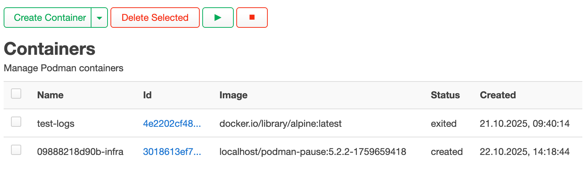
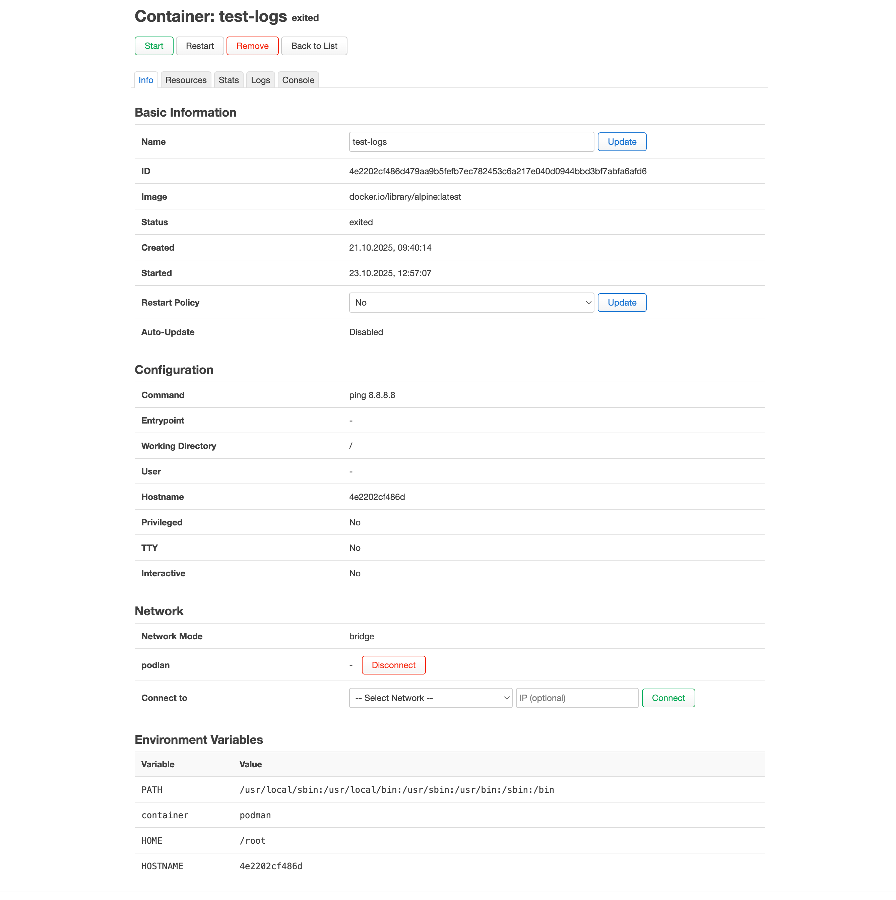
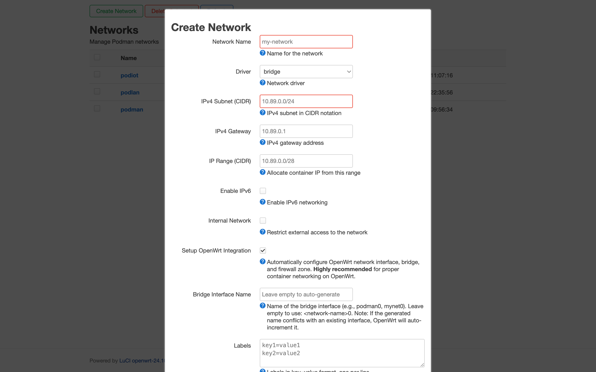

# LuCI App Podman

A modern LuCI web interface for managing Podman containers on OpenWrt.

[](LICENSE)
[](https://openwrt.org/)

## Table of Contents

- [Features](#features)
  - [Container Management](#container-management)
  - [Image Management](#image-management)
  - [Volume Management](#volume-management)
  - [Network Management](#network-management)
  - [Pod Management](#pod-management)
  - [Secret Management](#secret-management)
  - [System Overview](#system-overview)
- [Screenshots](#screenshots)
- [Requirements](#requirements)
- [Installation](#installation)
  - [Option 1: From IPK Package](#option-1-from-ipk-package)
  - [Option 2: Build from Source](#option-2-build-from-source)
  - [Option 3: Build Custom OpenWrt Image](#option-3-build-custom-openwrt-image)
- [Getting Started](#getting-started)
- [Configuration](#configuration)
  - [Podman Configuration](#podman-configuration)
  - [UCI Configuration](#uci-configuration)
- [Usage Tips](#usage-tips)
  - [Container Logs](#container-logs)
  - [Resource Management](#resource-management)
  - [Network Integration](#network-integration)
  - [Bulk Operations](#bulk-operations)
- [Troubleshooting](#troubleshooting)
- [Development](#development)
  - [Architecture](#architecture)
  - [Code Quality](#code-quality)
  - [Testing](#testing)
  - [Building](#building)
- [Project Structure](#project-structure)
- [Credits](#credits)
- [Contributing](#contributing)
- [License](#license)
- [Support](#support)

## Features

### Container Management
- **List & Control**: View all containers with status, start/stop/restart/remove operations
- **Detail View**: Tabbed interface with Info, Resources, Stats, Logs, and Console tabs
- **Live Logs**: Real-time log streaming with configurable line count
- **Resource Limits**: Configure CPU, memory, and Block I/O limits on running containers
- **Network Management**: Connect/disconnect containers to/from networks with optional static IPs
- **Restart Policies**: Configure automatic restart behavior (no, always, on-failure, unless-stopped)

### Image Management
- **Pull Images**: Download images from registries with streaming progress
- **Bulk Operations**: Pull latest versions or remove multiple images at once
- **Image Inspection**: View detailed image metadata and layer information

### Volume Management
- **Create & Manage**: Create volumes with custom drivers (local, image) and mount options
- **Labels**: Organize volumes with custom labels
- **Bulk Delete**: Remove multiple volumes with confirmation

### Network Management
- **Multiple Drivers**: Support for bridge, macvlan, and ipvlan networks
- **OpenWrt Integration** (Optional): Automatic OpenWrt network/firewall configuration
  - Bridge device creation
  - Network interface setup with static IP
  - Firewall zone with DNS access rules
  - One-click setup for existing networks
- **Custom Subnets**: Configure subnet, gateway, and IPv6 settings
- **Internal Networks**: Create isolated container networks

### Pod Management
- **Multi-Container Pods**: Group containers with shared network namespace
- **Pod Controls**: Start, stop, restart, pause/unpause operations
- **Port Mappings**: Configure pod-level port forwarding
- **Resource Stats**: Monitor pod CPU and memory usage

### Secret Management
- **Secure Storage**: Create encrypted secrets for sensitive data
- **Base64 Encoding**: Automatic encoding for secret data
- **Read-Once**: Secrets cannot be retrieved after creation (security by design)

### System Overview
- **Dashboard**: System info, version, running resources count
- **Disk Usage**: View space usage by images, containers, and volumes
- **Prune Operations**: Clean up unused resources system-wide
- **Auto-Update**: Trigger automatic container updates

## Screenshots


*Container management with status indicators and bulk operations*


*Detailed container view with live logs and stats*


*Network creation with OpenWrt integration option*

## Requirements

- **OpenWrt**: 24.10.x or later (tested on 24.10.0)
- **Podman**: 4.0+ with REST API enabled
- **LuCI**: Modern LuCI interface
- **Storage**: Sufficient space for container images and data

## Installation

### Option 1: From IPK Package

Download the latest IPK from [Releases](https://github.com/Zerogiven-OpenWRT-Packages/luci-app-podman/releases):

```bash
# Transfer to router
scp luci-app-podman_*.ipk root@192.168.1.1:/tmp/

# Install on router
ssh root@192.168.1.1
opkg update
opkg install /tmp/luci-app-podman_*.ipk
```

### Option 2: Build from Source

Requires OpenWrt ImageBuilder or SDK:

```bash
# Clone repository
git clone https://github.com/Zerogiven-OpenWRT-Packages/luci-app-podman.git
cd luci-app-podman

# Build package (in OpenWrt build environment)
make package/luci-app-podman/compile V=s

# Find built package
find bin/packages -name "luci-app-podman*.ipk"
```

### Option 3: Build Custom OpenWrt Image

Include this app in your custom firmware:

```bash
# In OpenWrt buildroot
cd openwrt

# Add this feed to feeds.conf.default:
# src-git podman https://github.com/Zerogiven-OpenWRT-Packages/luci-app-podman.git

# Update feeds
./scripts/feeds update -a
./scripts/feeds install -a

# Configure build
make menuconfig
# Select: LuCI → Applications → luci-app-podman

# Build image
make -j$(nproc)
```

## Getting Started

The OpenWrt Podman package automatically installs a procd init script that starts the Podman API socket service. After installing `luci-app-podman`, simply access the web interface:

**LuCI Menu**: Navigate to **System → Podman**

**Direct URL**: `http://your-router-ip/cgi-bin/luci/admin/podman`

> **Note**: If you encounter "Podman socket not found" errors, ensure the Podman service is running:
> ```bash
> /etc/init.d/podman start
> /etc/init.d/podman enable  # Enable on boot
> ```

## Configuration

### Podman Configuration

Recommended `/etc/containers/containers.conf`:

```ini
[network]
network_backend = "netavark"
firewall_driver = "none"  # Let OpenWrt firewall handle rules
network_config_dir = "/etc/containers/networks/"
default_network = "podman"
default_subnet = "10.129.0.0/24"
```

### UCI Configuration

Edit `/etc/config/podman`:

```
config podman 'globals'
	option socket_path '/run/podman/podman.sock'
```

## Usage Tips

### Container Logs
- Use "Live Stream" checkbox for real-time logs
- Adjust "Lines" field (10-10000) to control history
- Logs auto-cleanup on stream stop or browser close

### Resource Management
- Update CPU/memory limits on running containers without restart
- Changes apply immediately via Podman's update API

### Network Integration
- Enable "Setup OpenWrt Integration" when creating networks
- Automatically configures firewall zones and DNS access
- Alert icon (⚠) shows incomplete integration - click to fix

### Bulk Operations
- Use checkboxes + "Select All" for batch operations
- Confirmation dialogs show affected resources
- Progress feedback for long-running operations

## Troubleshooting

### "Podman socket not found"
```bash
# Verify socket exists
ls -l /run/podman/podman.sock

# Check Podman service
ps | grep podman

# Restart service
/etc/init.d/podman-socket restart
```

### "Access denied" errors
```bash
# Check ACL permissions
cat /usr/share/rpcd/acl.d/luci-app-podman.json

# Restart rpcd
/etc/init.d/rpcd restart
```

### Logs not showing
```bash
# Check log stream sessions
ls -l /tmp/podman_logs_*

# Cleanup orphaned sessions (automatic via cron)
find /tmp -name 'podman_logs_*.log' -mmin +5 -delete
```

### RPC debugging
```bash
# Test RPC methods directly
ubus call luci.podman containers_list '{"query":"all=true"}'
ubus call luci.podman version '{}'

# Check logs
logread | grep -i podman
```

## Development

### Architecture

**Frontend** (`htdocs/luci-static/resources/`)
- Modern ES6+ JavaScript with LuCI framework
- Shared RPC client (`podman/rpc.js`)
- Reusable utilities (`podman/utils.js`, `podman/ui.js`)
- Custom components (pui.Button, pui.MultiButton, pui.ListViewHelper)

**Backend** (`root/usr/libexec/rpcd/luci.podman`)
- Shell script RPC handler
- Communicates with Podman REST API v5.0.0 via curl
- Streaming support for logs and image pulls
- Session-based background operations

**OpenWrt Integration** (`podman/openwrt-network.js`)
- Direct UCI/network API manipulation
- Bridge device, interface, and firewall zone creation
- No shell script dependencies - pure JavaScript

### Code Quality

- JSDoc documentation for all functions
- Arrow functions for callbacks, `function` for lifecycle methods
- Proper error handling with user-friendly notifications
- Production-ready: debug code removed, console.error retained

### Testing

```bash
# Test RPC backend
ubus call luci.podman containers_list '{"query":"all=true"}'

# Test network integration
ubus call luci.podman network_create '{"data":"{\"name\":\"test\",\"driver\":\"bridge\"}"}'

# Monitor logs
logread -f | grep luci.podman
```

### Building

See [Installation Option 2](#option-2-build-from-source) above.

## Project Structure

```
luci-app-podman/
├── Makefile                                    # OpenWrt package build
├── htdocs/luci-static/resources/
│   ├── podman/
│   │   ├── rpc.js                             # RPC API client
│   │   ├── utils.js                           # Shared utilities
│   │   ├── ui.js                              # Custom UI components
│   │   ├── constants.js                       # Constants and defaults
│   │   ├── form.js                            # Form base classes
│   │   └── openwrt-network.js                 # OpenWrt network integration
│   └── view/podman/
│       ├── overview.js                        # Dashboard
│       ├── containers.js                      # Container list
│       ├── container.js                       # Container detail (NEW)
│       ├── images.js                          # Image management
│       ├── volumes.js                         # Volume management
│       ├── networks.js                        # Network management
│       ├── pods.js                            # Pod management
│       └── secrets.js                         # Secret management
├── root/
│   ├── etc/
│   │   ├── config/podman                      # UCI config
│   │   ├── cron.d/podman-cleanup              # Orphaned session cleanup
│   │   └── uci-defaults/luci-podman           # Defaults script
│   ├── usr/libexec/rpcd/luci.podman           # RPC backend
│   ├── usr/share/luci/menu.d/luci-app-podman.json
│   └── usr/share/rpcd/acl.d/luci-app-podman.json
└── po/                                         # Translations (i18n)
```

## Credits

Heavily inspired by:
- [openwrt-podman](https://github.com/breeze303/openwrt-podman/) - Podman on OpenWrt foundation
- [luci-app-dockerman](https://github.com/lisaac/luci-app-dockerman) - Docker LuCI app design patterns

## Contributing

Contributions welcome! Please:

1. Fork the repository
2. Create a feature branch (`git checkout -b feature/amazing-feature`)
3. Commit changes (`git commit -m 'Add amazing feature'`)
4. Push to branch (`git push origin feature/amazing-feature`)
5. Open a Pull Request

## License

Apache License 2.0 - see [LICENSE](LICENSE) file for details.

## Support

- Issues: [GitHub Issues](https://github.com/Zerogiven-OpenWRT-Packages/luci-app-podman/issues)
- Documentation: [Wiki](https://github.com/Zerogiven-OpenWRT-Packages/luci-app-podman/wiki)
- OpenWrt Forum: [LuCI Podman Thread](https://forum.openwrt.org/)
